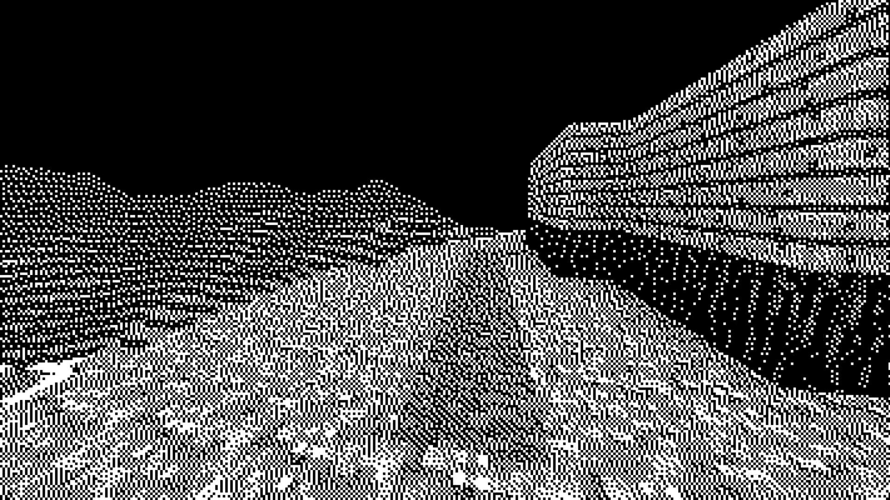

# PointCraft

**A Floyd-Steinberg dithering algorithm implemented into a minecraft clone**

This repository is a fork of [glCraft](https://github.com/Isti01/glCraft)

## Screenshots




## Building the project

- How to build it in CLion
  - 
    - Clone the repository
  ```shell
  git clone --recursive https://github.com/MartensCedric/PointCraft.git
  ```

    - Open it in CLion and press the green magic button.

- How to build it using CMake
  - 
    - Clone the repository
  ```shell
  git clone --recursive https://github.com/MartensCedric/PointCraft.git
  ```

    - Build the project *the build_type can be either Release or Debug*
  ```shell
  cd PointCraft
  mkdir build
  cd build
  cmake -DCMAKE_BUILD_TYPE=<build_type> ..
  cmake --build .
  ```

    - Run the game on Linux *with an optional save to load*:
  ```shell
  ./point_craft <saved-world.glc>
  ```

    - Or on Windows *with an optional save to load*
  ```batch
  point_craft.exe <saved-world.glc>
  ```

## Features

- Rendering
  - An implementation of the Floyd-Steinberg Dithering algorithm was used [See Wikipedia](https://en.wikipedia.org/wiki/Floyd%E2%80%93Steinberg_dithering).
  - The implementation is unfortunately on the CPU since the algorithm cannot be run in parallel due to the sequential requirements.
  - A parameter called `diffusion_multiplier` is available to multiply the Floyd-Steinberg fractions.

- Controls
  -
    - `Left Click` to break a block
    - `Middle Click` to pick a block
    - `Right Click` to place a block
    - `WASD`  to move around
    - `Shift` to descend when physics is off
    - `Space` to ascend when physics is off, or jump when physics is on
    - `Ctrl` to go faster
    - `Esc` to open the menu


